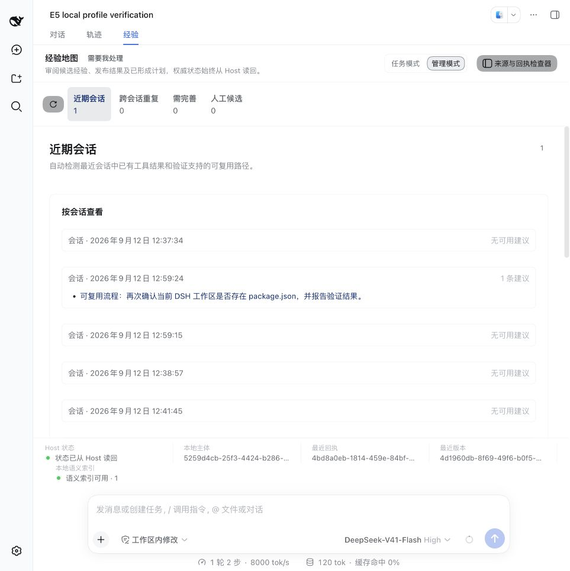

# Experience Map for DeepSeek Harness

English | [中文](README.zh.md)

> Status: `0.1.0-beta.3` public beta, published as the unscoped npm package `dsh-experience-map` and as a matching GitHub Release tarball.

## Summary

Experience Map helps a DeepSeek Harness agent reuse a solution that already worked instead of exploring a different route every time a similar task appears. It turns selected Session evidence into a structured, versioned Experience, checks whether that Experience still applies to the current environment, and asks the user to approve the exact reuse plan before it affects a task. The Bundle works inside the existing Harness `Experience` tab and also supports Browser-free Host operation and an opt-in management CLI. SQLite owns the durable Experience records; Markdown, learning views, and the relation map are readable projections rather than competing memory stores.

## Table of Contents

- [Use this package](#use-this-package)
- [Five-minute quickstart](docs/QUICKSTART.md)
- [Plugin interoperability](#plugin-interoperability-and-runtime-hook-boundaries)
- [Understand the implementation](#understand-the-implementation)
- [Further Exploration](#further-exploration)
- [Model Experience](#model-experience)
- [Known Limitations and Deferred Work](#known-limitations-and-deferred-work)
- [Dev Note](#dev-note)
- [License](#license)

-----

<a id="use-this-package"></a>
## Use this package

Start with the [five-minute quickstart](docs/QUICKSTART.md). Automatic suggestion detection and recall are already enabled after installation: finish one task with a real outcome, open the conversation's `Experience` tab, and decide only whether a save-ready suggestion should become durable Experience memory. The same guide gives reproducible headless and management CLI commands and their approval boundaries.

Interface preview from an isolated demo profile with de-identified sample data:



### Problems it solves

Ordinary chat history can remind a model what was said, but it does not reliably tell the model which steps worked, under which conditions, who approved them, or whether the old result is still valid. A vector search can retrieve similar text, but similarity alone is not permission to reuse a procedure.

| Recurring problem | Experience Map response |
| --- | --- |
| Similar tasks take different routes | Store the successful route as typed, versioned components. |
| A past answer lacks evidence | Bind each claim and step to exact source references and evidence grades. |
| An old solution may be stale | Run a current Preflight before proposing reuse. |
| Automatic memory extraction can preserve mistakes | Create a Candidate first; a user reviews its fields before publication. |
| Several Experiences overlap or conflict | Compose selected contributions deterministically and disclose discarded or overridden items. |
| A plausible result may not be a real success | Verify the current external state and create an immutable Settlement. |
| Knowledge changes over time | Publish a new Version, retain the old record, or Forget future retrieval. |

The result is an experience map, not only a knowledge graph. It records facts and relations, but it also records applicability, decisions, execution progress, verification, outcomes, revisions, and governance.

### What an Experience contains

An Experience is a reusable decision or execution asset with an intent, scope, validity conditions, typed components, source evidence, risk and effect information, allowed use modes, and immutable versions.

The first product phase supports six kinds:

| Kind | Captures |
| --- | --- |
| Procedure | Repeatable steps, checkpoints, side-effect rules, failure branches, and verifiers. |
| Diagnostic | Symptoms, observations, hypotheses, discriminators, misleading signals, resolutions, and recovery checks. |
| Strategy | Decision points, options, constraints, criteria, trade-offs, stop rules, and outcome measures. |
| Preference Policy | User or organization preferences, authority, scope, override policy, and examples. |
| Fact | Sourced statements, qualifiers, validity periods, and contradiction policy. |
| Causal | A causal candidate with a mechanism, competing explanations, evidence links, a falsifier, and an explicit causal grade. |

A Causal Experience is not automatically treated as established causality. The product keeps `causal_candidate` distinct from stronger evidence grades and never lets a confidence score replace evidence.

### Automatic suggestions and the save gate

By default, the Bundle locally scans bounded intervals from recently completed Sessions and lists zero or more suggestions by Session. Repeated occurrences of the same stable kernel across Sessions share one group and one save action. This recent-N/TTL projection is disposable rather than a second durable experience store; unattended expired suggestions may be discarded.

- A verified Procedure/Diagnostic, a verbatim user Preference with explicit scope and exception semantics, or a fresh structured Fact whose declared authority matches the actual tool call may become save-ready.
- Strategy remains `needs_enrichment` or `needs_review`; Causal always begins as a `causal_candidate`. Neither local rules nor a model can promote them directly into one-click save.
- Automatic detection, grouping, and default recall make no external model call. This release records the optional enrichment mode and DSH generation route, but reports enrichment as `configured_but_unavailable` until a real foreground producer, disclosure/budget receipt, and supported call configuration exist; it never silently calls that route or bypasses the deterministic publication gate.
- A new task accepts at most one primary match after type-specific hard gates, thresholds, and margin checks. Weak or inconsistent evidence abstains, and an expired Fact contributes nothing after Preflight.

### Requirements

- DeepSeek Harness `0.1.5-rc.2`.
- Node.js `^22.19.0` or `>=24.0.0`.
- A configured Harness LLM provider only when you want the model to propose a Candidate.
- `@huggingface/transformers` only when you deliberately enable the optional local dense-retrieval adapter. It is not installed automatically; review [SECURITY.md](SECURITY.md) first.

The npm package **does not bundle Transformers.js or model weights and does not download a model automatically**. The two recall modes have different evidence boundaries:

| Mode | Installed state | Best fit | Current evidence boundary |
| --- | --- | --- | --- |
| Deterministic hard gates + MiniSearch lexical ranking | Default; no model required | Zero extra model dependency and precision-first abstention | 12/12 with zero harmful matches on the frozen 12-case replay. This is not broad recall evidence; paraphrases and cross-language tasks may still be missed. |
| The same hard gates + local multilingual E5 hybrid ranking | Explicit opt-in | Calibrated Procedure/Diagnostic paraphrases, bilingual, and semantically similar tasks | 12/12 with zero harmful matches on the same hybrid replay. The 108-case quality suite also used local E5 for semantic equivalence, component mapping, and applicability, but those 108 cases are not all recall queries. |

Vector similarity only discovers and ranks candidates after the hard gates. It cannot by itself authorize saving, exact merging, Context injection, or tool execution. Automatic dense applicability and semantic equivalence are currently calibrated only for Procedure and Diagnostic; another Experience kind cannot cross deterministic gates merely because it has a high vector score. To reproduce the release-tested local semantic path, follow the [pinned setup in the quickstart](docs/QUICKSTART.md#5-optional-enable-the-evaluated-local-semantic-recall) for `@huggingface/transformers@4.2.0` and the exact `Xenova/multilingual-e5-small` revision. Do not reuse these thresholds with an uncalibrated model. A missing, drifted, or unavailable model produces an explicit lexical fallback.

### Install the public beta

Add the public npm package to a Web profile and start that profile:

```sh
dsh plugin --profile web add dsh-experience-map@0.1.0-beta.3
dsh web
```

The matching prebuilt tarball is also available from the immutable [GitHub Release](https://github.com/alcheme-labs/dsh-experience-map/releases/tag/v0.1.0-beta.3).

When running DSH from its source checkout, replace `dsh` with `pnpm dsh`. To build the same package from source instead:

```sh
git clone https://github.com/alcheme-labs/dsh-experience-map.git
cd dsh-experience-map
pnpm install
pnpm run build
pnpm pack
```

After installation, refresh any already-open Harness browser tabs, then open a conversation and select the `Experience` tab. A Host restart does not replace JavaScript already loaded in a tab. The Bundle does not open a separate website.

### Configure Experience Map

Open `Settings → Plugins → Plugin configuration`, then expand `Experience Map`. The card exposes the 28 settings that can safely apply to the next operation without a Host restart. Changes are staged locally and saved as one revision-fenced mutation; a rejected or conflicting save keeps the draft for correction. Each operation captures one immutable settings snapshot, so a save never changes an extraction, Plan, verification, or learning batch already in progress. Candidate disclosure shows the captured settings revision and digest, and a later settings change invalidates the old confirmation.

The card groups default behavior and model generation first, with source/evidence, planning/verification, and learning batch controls under advanced sections. Resetting a field removes its user override and restores the Bundle composition value. The settings document never becomes a second Experience-domain writer: SQLite continues to own Candidates, Versions, Plans, Settlements, revisions, relations, and governance.

Database ownership and SQLite pragmas, the optional historical and verified-outcome fixtures, `taskFingerprintProposalMode`, and `learningPollIntervalMs` remain startup-only Cordis configuration. They are not presented as live controls because changing them requires resource re-registration, fixture revalidation, or worker restart.

### Save an Experience from automatic suggestions

1. Finish or diagnose a real task in a Harness conversation.
2. Open `Experience` and inspect automatic suggestions by recent Session, cross-Session repetition, or incomplete state; no type selection is required first.
3. Choose `Save as experience` for a suggestion that passed the save gate, or dismiss an unwanted suggestion. Exact repeats target one Experience Series.
4. Content that needs judgment continues through Candidate review: inspect the exact disclosure and model route, confirm it, accept/edit/reject each field, then publish an immutable Experience Version. The Bundle does not retry a paid model request automatically.

### Reuse an Experience

1. Submit a similar task.
2. Review matches and the current Preflight results in the task-mode workbench.
3. Inspect the exact Plan, including selected and discarded contributions.
4. Approve, adapt, or reject that Plan.
5. Let the next exact task consume its one-time binding and deliver minimal Experience Context.
6. Advance the guided steps, run current verification, and settle the outcome.
7. Create a Revision when the evidence shows that only part of the Experience must change.

### Use headless and management modes

The Host plugin can load without Browser services, so CLI/headless profiles remain valid:

```sh
pnpm dsh plugin --profile headless add dsh-experience-map@0.1.0-beta.3
pnpm dsh --profile headless "your task"
```

Automatic Session suggestion detection and Experience recall are enabled by default. Saving a suggestion remains an explicit owner decision, and `defaultMustUseExperience` defaults to `false`: a match may prepare a Plan, but it does not force the task to use it. Context is injected only after the current Plan is approved; automatic tool execution remains disabled.

Management commands are intentionally excluded from ordinary Web and headless profiles. A dedicated management profile can mount `dsh-experience-map/cli/startup` and `dsh-experience-map/cli/runner`, then query the same Host-owned state:

```sh
pnpm dsh --profile experience-management experience status
pnpm dsh --profile experience-management experience suggestions-show
pnpm dsh --profile experience-management experience suggestion-save --input /absolute/path/to/save-suggestion.json
pnpm dsh --profile experience-management experience suggestion-dismiss --input /absolute/path/to/dismiss-suggestion.json
pnpm dsh --profile experience-management experience candidate-list
pnpm dsh --profile experience-management experience plan-list
pnpm dsh --profile experience-management experience learning-governance-show
```

### Plugin interoperability and runtime-hook boundaries

Experience Map intentionally participates in the Host's global `agent/pre-step` flow, observes `session/event` and `llm/stream`, and installs a narrow per-Agent tool guard only while an approved Usage is active. These surfaces let it match the current direct user task, inject only the exact approved Experience Context, prove that the prepared Context reached the Session and model-request boundaries, and correlate guided steps with real tool results. They do not transfer ownership of model calls, tools, jobs, approvals, or the Session Log away from DeepSeek Harness, and they do not enable automatic tool execution.

Using the same lifecycle events is not by itself a conflict. Compatibility risk appears when another plugin changes the meaning or continuity of those shared boundaries, for example when it:

- short-circuits or rejects `agent/pre-step` before downstream handlers can run, or removes, reorders, or replaces messages without preserving their `source` identity;
- applies a global allow/review/deny policy to every tool call without composing with existing Agent-scoped guards and Harness approval semantics;
- suppresses, rewrites, or consumes `session/event`, `llm/stream`, or tool-result signals that Experience Map needs for delivery and execution correlation;
- keeps approval, failure, or safety state globally across actors or Sessions, or substitutes that state for the Host-authenticated actor and the exact approved Plan; or
- assumes sole ownership of hook ordering, Context injection, approval resumption, or execution-result handling.

In these cases, an approved Context may never reach the model, an unapproved or altered Context may become indistinguishable from the approved snapshot, a tool result may be attributed to the wrong Usage, or one plugin's rejection may prevent the Experience flow from reaching its authoritative readback. Before co-installing plugins that intercept Agent steps, rewrite messages, or enforce tool policy, validate them together in an isolated profile: preserve actor and Session identity, preserve `message.source`, confirm approved-only Context delivery to the exact model request, keep tool guards Session-scoped, and verify interruption and tool-result readback. Experience Map does not override another plugin's denial; incompatible global policy should be narrowed, ordered, or isolated at the profile level.

### Evidence and release status

A real paired DSH task observed **65.9% lower provider token volume**, **45.5% fewer tool calls**, and **46.2% fewer model steps** after the same matched Experience was approved and delivered. This is one short task family, not an average or guarantee. The exact task, controls, formulas, de-identified events, and non-claims are in [Benefit evidence](docs/release/BENEFIT_EVIDENCE.md).

The private development Git history contains raw historical acceptance material and must not be made public. Maintainers create a clean, allowlisted source snapshot instead. See [Open-source readiness](docs/release/OPEN_SOURCE_READINESS.md), [Security policy](SECURITY.md), and [Contributing](CONTRIBUTING.md).

-----

<a id="understand-the-implementation"></a>
## Understand the implementation

<details>
<summary>Implementation internals — click to expand</summary>

### Lifecycle

```mermaid
flowchart LR
    A[Harness Session] --> B[Local detection and Session grouping]
    B --> C[Save readiness and user decision]
    C --> D[Direct save or reviewed Candidate]
    D --> E[One immutable Experience Version]
    E --> F[New task match and current Preflight]
    F --> G[Exact Plan and user decision]
    G --> H[Minimal Context and Harness tools]
    H --> I[Authoritative verification]
    I --> J[Settlement]
    J --> K[Revision, learning, audit, or Forget]
```



The LLM proposes Experience content; it does not decide what becomes trusted memory. The Host derives eligibility and evidence limits, validates the structured result, and persists a Candidate. The user can accept, edit, reject, withdraw, or publish the Candidate field by field.

When a later task arrives, the Host creates a task fingerprint, applies hard scope and privacy filters, retrieves bounded candidates, and checks current observations. It then composes an exact Plan that explains selected, discarded, conflicting, and overridden contributions. Only an authorized decision creates a one-time binding for the matching task.

During guided use, Experience Map tracks the approved steps and correlates them with real Harness tool events. Harness remains the owner of model calls, tools, jobs, shell, filesystem, Web access, approvals, and the Session Log. Success requires current authoritative readback; tool output alone is not treated as external truth.

### Ownership

| Owner | Responsibility |
| --- | --- |
| DeepSeek Harness | Session history, model routing, tools, jobs, shell, filesystem, Web access, approvals, and authenticated transport. |
| Experience Map Host | Candidate and Version lifecycle, matching, Preflight, composition, Plans, one-time bindings, guided progress, verification classification, Settlement, Revision, Forget, and governance. |
| Experience SQLite | The single durable writer for Experience-domain records. |
| Browser client | An embedded `conversation.view` workbench that reads and commands Host state; it is not an independent business-state owner. |
| Rebuildable projections | Learning views, Markdown exports, relation maps, and controlled evaluation reports. |

The package is one installable Bundle with Host, Browser `./client`, and opt-in management CLI faces. Its patch inserts one Host row, while the package manifest exposes the Browser face. The Session Log and Experience database remain separate sources of truth for their respective domains.

### Important defaults

| Setting | Default | Effect |
| --- | --- | --- |
| `automaticSuggestionDetection` | `true` | Completed local Session intervals are checked for bounded, disposable suggestions. |
| `automaticRecall` | `true` | New tasks automatically produce a conservative MatchSet; matching may abstain. |
| `automaticContextInjection` | `after_current_plan_approval` | Context is injected only after the current exact Plan is approved. |
| `automaticToolExecution` | `disabled` | Settings never grant execution; this build has no ExecutionBinding and cannot auto-run tools. |
| `reasoningEffort` | `low` | Candidate proposal uses bounded reasoning unless the Experience Map settings card changes it. |
| `maxTokens` | `8192` | A proposal can use this default, the model-route default, or a disclosed per-call custom limit. |
| `defaultTargetExposure` | `local` | Plans assume local exposure unless an authorized request states otherwise. |
| `observationFreshnessMs` | `300000` | Preflight observations expire after five minutes by default. |
| `planApprovalTtlMs` | `1800000` | A pending Plan decision expires after 30 minutes by default. |

### Source map

| File | Role |
| --- | --- |
| [`cordis.patch.yml`](cordis.patch.yml) | Bundle insertion and deployment defaults. |
| [`src/index.ts`](src/index.ts) | Host service composition and configuration. |
| [`src/runtime-settings.ts`](src/runtime-settings.ts) | Optional Settings adapter and immutable per-operation snapshots. |
| [`src/client/settings-card.tsx`](src/client/settings-card.tsx) | Embedded `Settings → Plugins` configuration card. |
| [`src/client/workspace.tsx`](src/client/workspace.tsx) | Embedded task and management workbench. |
| [`src/persistence/schema.ts`](src/persistence/schema.ts) | Canonical SQLite schema. |

</details>

-----

<a id="further-exploration"></a>
## Further Exploration

- [Type, relation, and composition decision](docs/decisions/m7-types-relations-composition.md) — how the six kinds contribute to a Plan.
- [Learning governance decision](docs/decisions/m7-learning-governance.md) — how predictions, labels, outcomes, and automation levels remain separate.
- [Three-arm evaluation decision](docs/decisions/m7-three-arm-evaluation.md) — what the current evaluation proves and does not prove.
- [Benefit evidence](docs/release/BENEFIT_EVIDENCE.md) — a real paired task, measured savings signal, controls, and explicit limits.
- [Open-source readiness](docs/release/OPEN_SOURCE_READINESS.md) — the clean-history, dependency, package, and publication gates.

-----

<a id="model-experience"></a>
## Model Experience

Direct during Candidate generation: after the user confirms the exact disclosure, Experience Map sends one structured request through the Harness LLM service and accepts Candidate content only from the disclosed result tool. Inspection, review, publication, audit, export, and ordinary management queries do not call the model.

Indirect during approved reuse: the Bundle records one minimal, source-identified `user/message` Context entry before the exact direct-user task. The Session Log makes that model-visible input reconstructable. A normal task cannot receive this Context without a current matching Plan and its authorized one-time binding.

#### KV Cache effect

The Bundle does not modify the static system prompt. Candidate proposal Sessions and Plan-specific Context vary by operation, so cache behavior after the stable prefix depends on the selected provider and request history.

-----

<a id="known-limitations-and-deferred-work"></a>
## Known Limitations and Deferred Work

- The npm release uses the unscoped package name `dsh-experience-map`; supported installation is pinned to the verified `0.1.0-beta.3` artifact.
- Automatic admission is disabled by default. All six learning and automation capabilities ship at `shadow`; no evaluation promotes them automatically.
- SQLite remains the canonical store; no graph database is required. Retrieval can optionally use a pinned local Transformers.js embedding artifact and otherwise keeps the lexical fallback. Transformers.js is an explicit optional peer while current upstream native dependency advisories remain open.
- Causal records remain evidence-graded candidates unless stronger evidence is reviewed; the Bundle is not a general causal-inference engine.
- Markdown is an export and revision input, not an authority that can directly overwrite a Version.
- Pre-release schema v8 rejects older local databases. Existing pre-release data needs to be discarded before this version starts.
- Forget stops canonical retrieval and retires active Experience Context, but it does not erase immutable Session history, provider copies, or external copies.
- The controlled three-arm evaluation contains one deterministic task case per arm. It verifies the evaluation path, not statistically reliable product improvement or external-model generalization.
- Governed Content/Vault, automatic publication, automatic revision or merge, causal promotion, and automatic execution are not enabled.

### Privacy and safety

- The complete Session remains local. Candidate generation sends only a bounded, typed evidence packet after the user reviews and confirms the disclosure.
- Assistant reasoning, intermediate commentary, non-execution tool noise, credentials, and secret-shaped inline content do not become Experience evidence.
- Every write resolves identity and authority inside the trusted Host adapter. Browser payloads and command JSON cannot assign their own authority.
- Candidate publication, Plan approval, tool approval, automation promotion, and causal promotion are separate decisions.
- Explicit `unknown` outcomes remain visible and never count as success.

-----

<a id="dev-note"></a>
### Dev Note

<details>
<summary>Working context for maintainers — click to expand</summary>

None.

</details>

-----

<a id="license"></a>
## License

[MIT](LICENSE)

Maintained by Alcheme Labs · an OPC (one-person company) practice. This is an independent, unofficial DeepSeek Harness community plugin.
