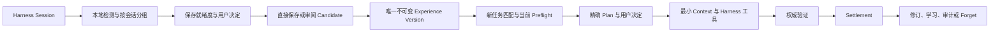

# DeepSeek Harness 经验地图

[English](README.md) | 中文

> 当前状态：`0.1.0-beta.3` 公开测试版，已通过无 scope 的 npm 包 `dsh-experience-map` 和内容一致的 GitHub Release tarball 发布。

## 概要

经验地图帮助 DeepSeek Harness Agent 直接复用已经成功的解决方案，避免每次遇到相似任务都重新探索不同路线。它把经过选择的 Session 证据转化为结构化、带版本的 Experience，在复用前检查当前环境是否仍然满足适用条件，并在影响任务之前让用户审阅和批准精确方案。Bundle 直接工作在 Harness 已有的“经验”标签页中，同时支持没有 Browser 服务的 Host 运行和可选的管理 CLI。SQLite 是经验记录的持久化权威来源；Markdown、学习视图和关系地图只是便于阅读或可重建的投影，不会形成相互竞争的记忆库。

## 目录

- [使用这个包](#使用这个包)
- [五分钟上手](docs/QUICKSTART.zh.md)
- [理解实现方式](#理解实现方式)
- [进一步了解](#进一步了解)
- [模型体验](#模型体验)
- [已知限制与延期能力](#已知限制与延期能力)
- [开发备注](#开发备注)
- [许可证](#许可证)

-----

<a id="使用这个包"></a>
## 使用这个包

第一次使用请从[五分钟上手](docs/QUICKSTART.zh.md)开始：安装后不需要先开启自动收集或自动召回；完成一个带真实结果的任务，打开当前会话的“经验”标签页，只对达到保存门的建议作出保存决定即可。终端用户的安装、查询、保存和 Plan 批准边界也在同一文档中给出了可复制命令。

界面预览来自隔离的演示 Profile，使用去标识样本数据：


### 它解决的问题

普通对话历史可以提醒模型“以前说过什么”，但无法可靠表达哪些步骤真正成功、成功依赖哪些条件、由谁批准，以及旧结果在当前环境中是否仍然有效。向量检索可以找到相似文本，但相似并不等于适用，更不等于获得了执行许可。

| 反复出现的问题 | 经验地图的处理方式 |
| --- | --- |
| 相似任务每次走不同路线 | 把成功路线保存为类型化、带版本的组件。 |
| 过去的回答缺少证据 | 把每个主张和步骤绑定到精确来源与证据等级。 |
| 旧方案可能已经失效 | 在建议复用前执行当前状态 Preflight。 |
| 自动提炼可能把错误写入长期记忆 | 先生成 Candidate，由用户逐字段审阅后才能发布。 |
| 多条经验重叠或冲突 | 确定性组合贡献，并披露丢弃项、冲突项和覆盖项。 |
| 看似成功的结果不一定真实成功 | 读取当前外部权威状态，并生成不可变 Settlement。 |
| 知识会随时间变化 | 发布新 Version，保留旧记录，或通过 Forget 停止未来召回。 |

因此它是一张经验地图，而不只是一张知识图谱。它既记录事实和关系，也记录适用性、决定、执行进度、验证、结果、修订和治理。

### 一条 Experience 包含什么

Experience 是一种可复用的决策或执行资产，包含意图、作用域、有效条件、类型化组件、来源证据、风险与影响、允许的使用方式和不可变版本。

第一产品阶段支持六类 Experience：

| 类型 | 记录内容 |
| --- | --- |
| Procedure（流程） | 可重复步骤、检查点、副作用规则、失败分支和验证器。 |
| Diagnostic（诊断） | 症状、观察、假设、判别条件、误导信号、解决方案和恢复检查。 |
| Strategy（策略） | 决策点、候选方案、约束、标准、权衡、停止规则和结果指标。 |
| Preference Policy（偏好策略） | 用户或组织偏好、权威来源、作用域、覆盖规则和示例。 |
| Fact（事实） | 有来源的事实、限定条件、有效期和冲突处理策略。 |
| Causal（因果） | 因果候选、机制、竞争解释、证据链接、反证方式和明确的因果等级。 |

Causal Experience 不会自动被当作已经成立的因果关系。产品会区分 `causal_candidate` 和更强的证据等级，也不会让置信分数替代证据。

### 自动建议与保存门

Bundle 默认在本地扫描最近已完成的 Session 区间，并按会话列出零到多条有界建议；同一稳定内核跨会话重复出现时只显示一个组和一个保存入口。这个短期投影受最近会话数和 TTL 限制，不是第二个长期经验库，过期且未处理的建议可以直接丢弃。

- 有最终验证证据的 Procedure/Diagnostic、包含明确作用域与例外的用户 Preference 原话，以及来源声明与实际工具调用一致且仍在有效期内的结构化 Fact，才可能显示“保存为经验”。
- Strategy 保持“需增强/需审阅”；Causal 始终先是 `causal_candidate`，两者都不会由本地规则或模型直接晋升为可一键保存。
- 自动检测、分组和默认召回不调用外部模型。可选模型增强必须由配置和披露控制，且不能绕过相同的确定性发布门。
- 新任务只接受一个通过类型专属硬门、阈值和 margin 的主匹配；证据不足或语义字段不一致时直接不匹配。Fact 过期后在 Preflight 中停止贡献。

### 环境要求

- DeepSeek Harness `0.1.5-rc.2`。
- Node.js `^22.19.0` 或 `>=24.0.0`。
- 只有在让模型生成 Candidate 时才需要配置 Harness LLM Provider。
- 只有明确启用本地稠密检索适配器时，才需要 `@huggingface/transformers`。它不会被自动安装，启用前请先阅读 [SECURITY.md](SECURITY.md)。

### 安装公开测试版

把公开 npm 包添加到 Web Profile，然后启动该 Profile：

```sh
dsh plugin --profile web add dsh-experience-map@0.1.0-beta.3
dsh web
```

内容一致的预构建 tarball 也可以从不可变的 [GitHub Release](https://github.com/alcheme-labs/dsh-experience-map/releases/tag/v0.1.0-beta.3) 下载。

如果从 DSH 源码运行命令，把 `dsh` 换成 `pnpm dsh`。如果希望自行从源码生成同样的包：

```sh
git clone https://github.com/alcheme-labs/dsh-experience-map.git
cd dsh-experience-map
pnpm install
pnpm run build
pnpm pack
```

安装完成后先刷新已经打开的 Harness 浏览器标签页，再打开一个会话并选择“经验”标签页。重启 Host 不会替换标签页里已经加载的 JavaScript。这个 Bundle 不会另起一个独立网站。

### 配置 Experience Map

打开“设置 → 插件 → 插件配置”，然后展开“Experience Map”。卡片提供 28 个可以安全作用于下一次操作、无需重启 Host 的设置。修改先保留在本地草稿中，保存时作为一次带版本条件的原子变更提交；如果发生校验失败或版本冲突，草稿会保留以便修正。每次操作只在入口冻结一份不可变设置快照，因此保存新设置不会改变已经开始的提炼、Plan、验证或学习批次。Candidate 披露会显示本次使用的设置版本和摘要；设置变化后，旧披露确认会自动失效。

卡片优先展示默认行为和模型生成，把来源与证据预算、匹配与验证、学习批次放在高级分组中。恢复某个字段会删除用户覆盖值，重新继承 Bundle 组合配置。设置文档不会成为第二个 Experience 领域写入者：Candidate、Version、Plan、Settlement、修订、关系和治理状态仍由 SQLite 独占。

数据库所有权与 SQLite 参数、可选历史来源和已验证结果夹具、`taskFingerprintProposalMode`、`learningPollIntervalMs` 仍然属于启动期 Cordis 配置。它们需要重新注册资源、重新验证夹具或重启 Worker，因此不会伪装成实时设置。

### 从自动建议保存 Experience

1. 在 Harness 会话中完成或诊断一个真实任务。
2. 打开“经验”，按最近 Session、跨会话重复或需完善状态检查自动建议；无需先理解或选择经验类型。
3. 对达到保存门的建议选择“保存为经验”，或忽略/丢弃不需要的建议。完全重复的建议只会面向一个 Experience Series。
4. 需要补充判断的内容继续走 Candidate：审阅精确披露和模型路由，确认后逐字段接受、编辑或拒绝，再发布为不可变 Experience Version。Bundle 不会自动重试付费模型请求。

### 复用 Experience

1. 提交一个相似任务。
2. 在任务模式工作台中审阅匹配结果和当前 Preflight。
3. 检查精确 Plan，包括被选择和被丢弃的贡献。
4. 批准、调整或拒绝这个 Plan。
5. 让下一次完全相同的任务消费一次性绑定，并交付最小 Experience Context。
6. 推进引导步骤，运行当前验证，并结算结果。
7. 当证据表明只有部分 Experience 需要变化时，创建 Revision。

### 在 headless 和管理模式中使用

Host 插件可以在没有 Browser 服务的环境中加载，因此 CLI/headless Profile 可以正常运行：

```sh
pnpm dsh plugin --profile headless add dsh-experience-map@0.1.0-beta.3
pnpm dsh --profile headless "你的任务"
```

会话建议自动检测和 Experience 自动召回默认开启。保存建议仍然必须由 Owner 明确决定；`defaultMustUseExperience` 默认为 `false`，因此匹配可以生成 Plan，但不会强迫任务使用它。Experience Context 只会在当前 Plan 获批后注入，自动工具执行仍然关闭。

普通 Web 和 headless Profile 不包含管理命令。专用管理 Profile 可以挂载 `dsh-experience-map/cli/startup` 和 `dsh-experience-map/cli/runner`，然后查询同一个 Host 权威状态：

```sh
pnpm dsh --profile experience-management experience status
pnpm dsh --profile experience-management experience suggestions-show
pnpm dsh --profile experience-management experience suggestion-save --input /absolute/path/to/save-suggestion.json
pnpm dsh --profile experience-management experience suggestion-dismiss --input /absolute/path/to/dismiss-suggestion.json
pnpm dsh --profile experience-management experience candidate-list
pnpm dsh --profile experience-management experience plan-list
pnpm dsh --profile experience-management experience learning-governance-show
```

### 收益证据与发布状态

在一个真实的 DSH 配对任务中，同一条匹配经验经批准并注入后，观测到 **provider token volume 降低 65.9%**、**工具调用减少 45.5%**、**模型步骤减少 46.2%**。这只是一个短任务族的观测值，不是平均值或承诺。精确任务、控制条件、公式、去标识事件与不作出的主张见[收益证据](docs/release/BENEFIT_EVIDENCE.md)。

私有开发 Git 历史包含原始历史验收材料，不能直接公开。维护者必须生成一份经过白名单筛选的干净源码快照。具体边界见[开源准备状态](docs/release/OPEN_SOURCE_READINESS.md)、[安全策略](SECURITY.md)和[贡献指南](CONTRIBUTING.md)。

-----

<a id="理解实现方式"></a>
## 理解实现方式

<details>
<summary>展开实现细节</summary>

### 生命周期



LLM 只负责提出 Experience 内容，不负责决定什么可以成为可信记忆。Host 负责推导提炼资格与证据上限、验证结构化结果，并持久化 Candidate。用户可以逐字段接受、编辑、拒绝、撤回或发布 Candidate。

当新任务出现时，Host 会生成任务指纹，应用严格的作用域和隐私过滤，执行有界检索，并检查当前观察结果。随后它会组合出一个精确 Plan，解释被选择、被丢弃、发生冲突和被人工覆盖的贡献。只有有权用户的明确决定才能为相同任务创建一次性绑定。

在引导复用期间，经验地图跟踪已批准步骤，并把它们与真实 Harness 工具事件关联。模型调用、工具、后台任务、Shell、文件系统、Web、审批和 Session Log 仍由 Harness 负责。成功必须经过当前权威状态读回，工具输出本身不会被当作外部真相。

### 所有权

| 责任方 | 责任 |
| --- | --- |
| DeepSeek Harness | Session 历史、模型路由、工具、后台任务、Shell、文件系统、Web、审批和认证传输。 |
| Experience Map Host | Candidate 与 Version 生命周期、匹配、Preflight、组合、Plan、一次性绑定、引导进度、验证分类、Settlement、Revision、Forget 和治理。 |
| Experience SQLite | Experience 领域记录的唯一持久化写入者。 |
| Browser Client | 嵌入 `conversation.view` 的工作台，只读取并命令 Host 状态，不独立持有业务状态。 |
| 可重建投影 | 学习视图、Markdown 导出、关系地图和受控评测报告。 |

这个包是一个可安装 Bundle，包含 Host、Browser `./client` 和可选的管理 CLI。Bundle Patch 插入一个 Host 行，Package Manifest 则暴露 Browser Face。Session Log 和 Experience 数据库分别维护各自领域的权威事实。

### 重要默认配置

| 配置 | 默认值 | 作用 |
| --- | --- | --- |
| `automaticSuggestionDetection` | `true` | 在本地检查已完成的 Session 区间并生成有界、可丢弃的建议。 |
| `automaticRecall` | `true` | 新任务自动生成保守 MatchSet；证据不足时允许不匹配。 |
| `automaticContextInjection` | `after_current_plan_approval` | 仅在当前精确 Plan 获批后注入 Context。 |
| `automaticToolExecution` | `disabled` | 设置不能授予执行权；当前没有 ExecutionBinding，不能自动运行工具。 |
| `reasoningEffort` | `low` | 除非在 Experience Map 设置卡片中修改，否则 Candidate 提议使用有界推理。 |
| `maxTokens` | `8192` | 每次提议可以使用该默认值、模型路由默认值或已披露的自定义限制。 |
| `defaultTargetExposure` | `local` | 除非授权请求另有声明，否则 Plan 假定只在本地暴露。 |
| `observationFreshnessMs` | `300000` | Preflight 观察默认在五分钟后过期。 |
| `planApprovalTtlMs` | `1800000` | 待决定 Plan 默认在 30 分钟后过期。 |

### 源码索引

| 文件 | 作用 |
| --- | --- |
| [`cordis.patch.yml`](cordis.patch.yml) | Bundle 插入方式和部署默认值。 |
| [`src/index.ts`](src/index.ts) | Host 服务组合和配置。 |
| [`src/runtime-settings.ts`](src/runtime-settings.ts) | 可选 Settings 适配器与逐操作不可变快照。 |
| [`src/client/settings-card.tsx`](src/client/settings-card.tsx) | 嵌入“设置 → 插件”的配置卡片。 |
| [`src/client/workspace.tsx`](src/client/workspace.tsx) | 嵌入式任务与管理工作台。 |
| [`src/persistence/schema.ts`](src/persistence/schema.ts) | 权威 SQLite Schema。 |

</details>

-----

<a id="进一步了解"></a>
## 进一步了解

- [类型、关系与组合决定](docs/decisions/m7-types-relations-composition.md)——六种 Experience 如何为 Plan 提供贡献。
- [学习治理决定](docs/decisions/m7-learning-governance.md)——预测、标签、结果和自动化等级如何保持分离。
- [三组评测决定](docs/decisions/m7-three-arm-evaluation.md)——当前评测能够证明和不能证明什么。
- [收益证据](docs/release/BENEFIT_EVIDENCE.md)——真实配对任务、收益信号、控制条件与明确边界。
- [开源准备状态](docs/release/OPEN_SOURCE_READINESS.md)——干净历史、依赖、Package 与发布门槛。

-----

<a id="模型体验"></a>
## 模型体验

生成 Candidate 时直接影响模型：用户确认精确披露后，经验地图通过 Harness LLM 服务发送一次结构化请求，并且只从已经披露的结果工具中接受 Candidate 内容。本地检查、审阅、发布、审计、导出和普通管理查询不会调用模型。

复用已批准 Experience 时间接影响模型：Bundle 会在完全匹配的用户任务之前记录一条最小化、带来源身份的 `user/message` Context。Session Log 可以重建这份模型可见输入。没有当前匹配 Plan 及其已授权一次性绑定，普通任务不会收到这份 Context。

#### KV Cache 影响

Bundle 不修改静态系统提示词。Candidate 提议 Session 和 Plan 专用 Context 会随操作变化，因此稳定前缀之后的缓存效果取决于所选 Provider 和请求历史。

-----

<a id="已知限制与延期能力"></a>
## 已知限制与延期能力

- npm 使用无 scope 包名 `dsh-experience-map` 发布；受支持的安装命令固定使用经过验证的 `0.1.0-beta.3` 制品。
- 自动准入默认关闭。六项学习和自动化能力的发布等级都是 `shadow`；评测结果不会自动把它们晋级。
- SQLite 仍是权威存储，不需要图数据库。召回可以选择固定版本的本地 Transformers.js 向量模型制品；未配置或不可用时继续使用词法回退路径。在当前上游原生依赖安全公告关闭前，Transformers.js 是需要显式安装的可选 peer runtime。
- 因果记录仍是分等级的候选关系；这个 Bundle 不是通用因果推断引擎。
- Markdown 是导出和修订输入，不能直接覆盖 Version。
- pre-release schema v8 会拒绝旧本地数据库；启动当前版本前需要丢弃旧的预发布数据。
- Forget 会停止权威召回并退役仍然活跃的 Experience Context，但不会擦除不可变 Session 历史、Provider 副本或外部副本。
- 三组受控评测每组只有一个确定性任务样本。它证明评测链路可用，但不能证明统计可靠的产品提升或外部模型泛化。
- Governed Content/Vault、自动发布、自动修订或合并、因果晋级和自动执行均未启用。

### 隐私与安全

- 完整 Session 保留在本地。只有用户审阅并确认披露后，Candidate 生成才会发送有界、类型化证据包。
- Assistant reasoning、中间过程说明、非执行工具噪声、凭据和疑似秘密的内联内容不会成为 Experience 证据。
- 每次写入都由可信 Host Adapter 解析身份和权限。Browser 请求和命令 JSON 不能自行声明权限。
- Candidate 发布、Plan 批准、工具批准、自动化晋级和因果晋级是相互独立的决定。
- 明确的 `unknown` 结果会被保留，也永远不会被计为成功。

-----

<a id="开发备注"></a>
### 开发备注

<details>
<summary>展开维护者工作上下文</summary>

无。

</details>

-----

<a id="许可证"></a>
## 许可证

[MIT](LICENSE)

维护：杭州星原驱动科技有限公司 · OPC（超级个体）实践。本项目是独立、非官方的 DeepSeek Harness 社区插件。
